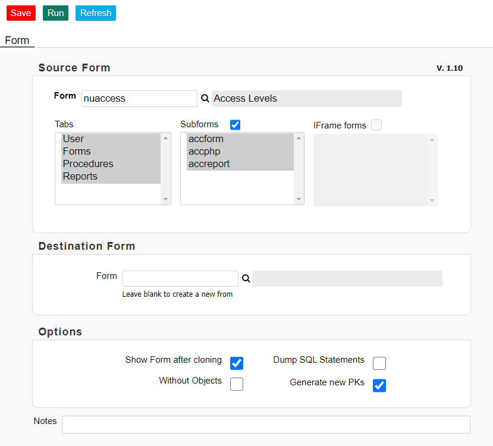

# nuBuilder 4 "cloner" form

## Description

This is a GUI form for the "cloner".

  

## Dependencies

The PHP Procedure ["cloner"] (https://github.com/smalos/nuBuilder4-cloner) is required.

## Importing the "cloner" form

(Import into an existing nuBuilder Database)

1. Download  [cloner_form.sql](cloner_form.sql)
2. Log into phpMyAdmin (In nuBuilder, go to the tab "Builders" and click on the "Database" button)
3. In phpMyAdmin, Click "Import" in the top menu
4. Under File to Import, click "Browse" and select the sql file to import.
5. Click "Go" at the bottom right to import the database file.
6. When the database has been imported successfully, you should see a message at the top of the page similar to: "Import has been successfully finished".
7. Log out from nuBuilder (if logged in) and  log in again for the changes to take effect.

## Note
A button "Cloner" will be added to the User Home / Fast Forms tab. If you cannot spot it, it might be hidden behind another object. Use "Arrange Objects" (CTRL+SHIFT+A) to move it to another position.
